# Swear Word Analysis

Bill Wang,

Andrew Vela,

Songjiang Zhou,

# Fair Warning, the following data project does contain the use of swear words and other offensive slurs as a part of the data.  

## Abstract

Since the start of the new millennium, the use of social media has continued to grow at an increasing rate as people have found themselves with the capabilities to express themselves online in a way that allows expressing their feelings to others without having to feel confined to a social setting where it can feel restrictive to what they can say. As this increasing use of social media has followed for many years, it has also come with many people being able to express things with curse words and slurs that vary in degrees of severity and range in different categories as to what they mean by these words. The main interest of our data analysis was to see if we could analyze what was the general purpose that people would intend their use of inflammatory language online, being able to see from our data source "profanity.csv" how each of these swear words was categorized, with this being the best way to gauge the general direction of the usage. We also gathered that the more common words by themselves were often slurs or common curse words said even in a social setting. Inside this data, we also were able to determine that more often than not, these inflammatory words reach a rating that would be deemed as 'strong', which was our highest severity ratings category used to judge these words. This project argues that the increasing use of social media has allowed people not only to express themselves online but also be much more severe in their word usage without the constant pressure of social setting standards, often use these words to express a manner that is seen as more sexual demeanor as their common reason.    

## Introduction

In recent years, the rise of social media platforms has revolutionized the way people communicate, providing an unprecedented level of freedom in expressing thoughts and emotions. However, this freedom has also led to the increased use of offensive language online, including curse words and slurs, which can vary significantly in severity and context. The pervasive use of such language poses challenges for maintaining respectful and safe online communities. To address these challenges, this research project aims to analyze the structural features of swear words and develop a model for efficient content filtering.

## About the Data

### Data Source
The data for this research project is sourced from the ["Collection of Profanities in English"](https://www.kaggle.com/datasets/konradb/profanities-in-english-collection) available on Kaggle. This dataset includes a wide range of English profanity words categorized by severity and type. The dataset aims to support the development of content moderation tools by providing a comprehensive list of offensive language.

### About the Data
This dataset contains over 1600 popular English profanities and their variations. The columns in the dataset include:

- text: The profanity word or phrase
- canonical_form_1: The primary canonical form of the profanity.
- canonical_form_2: An additional canonical form, if applicable.
- canonical_form_3: Another additional canonical form, if applicable.
- category_1: The profanity's primary category.
- category_2: The profanity's secondary category, if applicable.
- category_3: The profanity's tertiary category, if applicable.
- severity_rating: The average severity rating of the profanity, based on a scale from 1 to 3.
- severity_description: The description of the severity rating, rounded to the nearest integer and categorized as Mild (1), Strong (2), or Severe (3).

The profanities are organized into several categories to help understand their context and usage. These categories include:
- Sexual Anatomy / Sexual Acts
- Bodily Fluids / Excrement
- Sexual Orientation / Gender
- Racial / Ethnic Slurs
- Mental Disability
- Physical Disability
- Physical Attributes
- Religious Offense
- Political
- Other / General Insult

### EDA

In this Exploratory Data Analysis (EDA), we examined the distribution and severity of various offensive terms across multiple categories. Our goal was to understand the frequency and perceived severity of different types of offensive language. The analysis includes visualizations such as bar charts, histograms, and box plots to provide insights into the data.

**Key objectives of the EDA:#**

- Identify the most common swear words.
- Assess the average severity ratings of offensive terms by category.
- Examine the frequency distribution of categories.
- Analyze the distribution of severity ratings within each category.
- Understand the length distribution of swear words.
- Evaluate the frequency of swear words based on their severity ratings.
- The findings from the EDA will help us to better understand the data distribution and inform the development and evaluation of classification models.

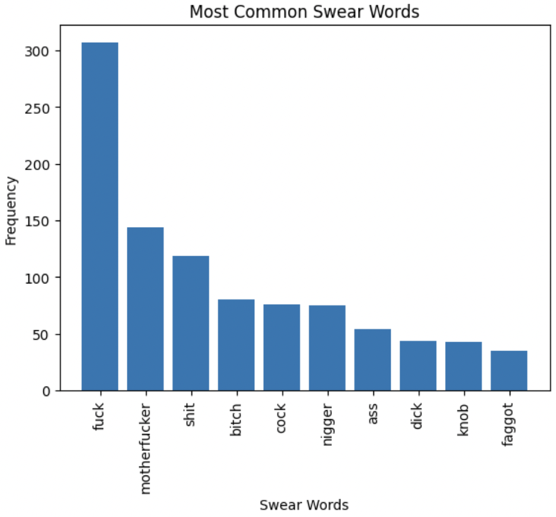

**Figure 1:Most Common Swear Words**
	
 Data Analysis: This data from this graph indicates how "Fuck" is by far the most commonly used inflammatory word documented as the following words like "motherfucker" and "shit" follow next, with this graph looking similar to an exponential decay graph.

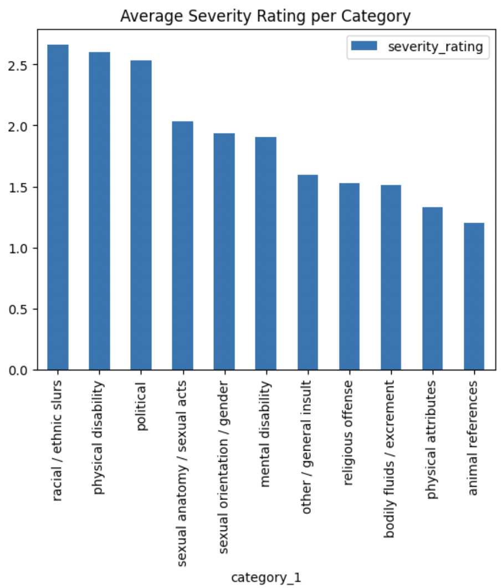

**Figure 2: Histogram Category Frequency**
	
 Data Analysis: The histogram shows that insults targeting race, physical disability, and political affiliations are perceived as the most severe, being the ones well above the mean of the overall data, hanging at around a 2.5 average severity rating. In contrast, insults involving animal references and physical attributes are perceived as the least severe as they almost average a severity rating of 1.

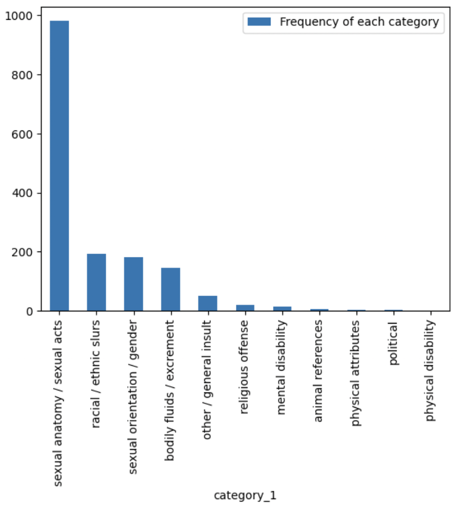

**Figure 3: Histogram Category Frequency**
	
 Data Analysis: This histogram indicates that almost all of the usage of informatory words fall into the category "sexual anatomy / sexual acts" as it reaches a peak of almost 1000 mentions. The next highest categories "racial / ethnic slurs", "sexual orientation / gender" and "bodily fluids / excrement" reached only about 200 mentions, with the rest categories barely showing a mark on the graph.  

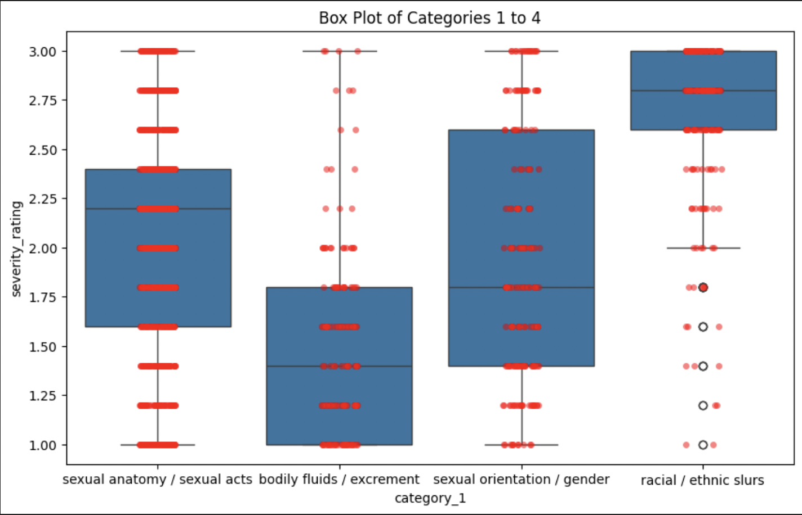

**Figure 4: Box Plot 1**
	
 Data Analysis: This Box Plot indicates how for a category like "racial / ethnic slurs", it's almost exclusively involved words that reached the highest severity ratings as the median here is 2.75 but given the many outliers as a result, the median is much higher than the average as a result. "Sexual Orientation / Gender" and "Sexual Anatomy / Sexual Acts" both have similar values but while words falling into sexual orientation have a larger box plot than those revolving around sexual anatomy, the sexual anatomy category has a higher median. "Bodily Fluids / Excrement" stands out here as much less severe on average as the whole box plot is less than the average severity score, with only a few outliers being given a two in this category

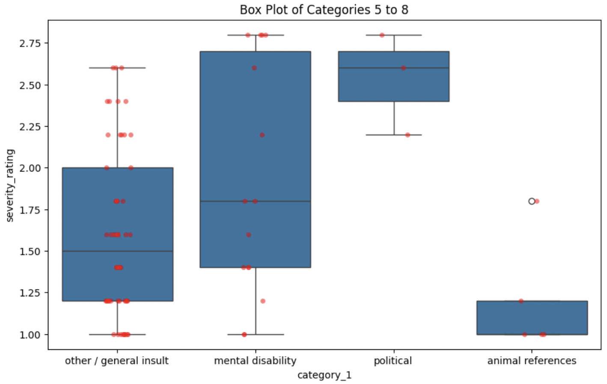

**Figure 5: Box Plot 2**
	
 Data Analysis: The category "Animal References" have the lowest and least variable severity ratings, indicating they are generally viewed as less offensive given the few data points show all but one being on the lower ends of the severe ratings. The "Political" category also has a small subset of a few data points indicating the opposite with a much more severe rating with a much higher median than the rest of the categories on this chart. "Other / General Insult" and "Mental Disability" have a similar box plot coverage that almost covers a large part of the possible data points resulting in neither having any outliers, as both widely range in values, although general insults come out to have a lower median overall than mental disability's median.

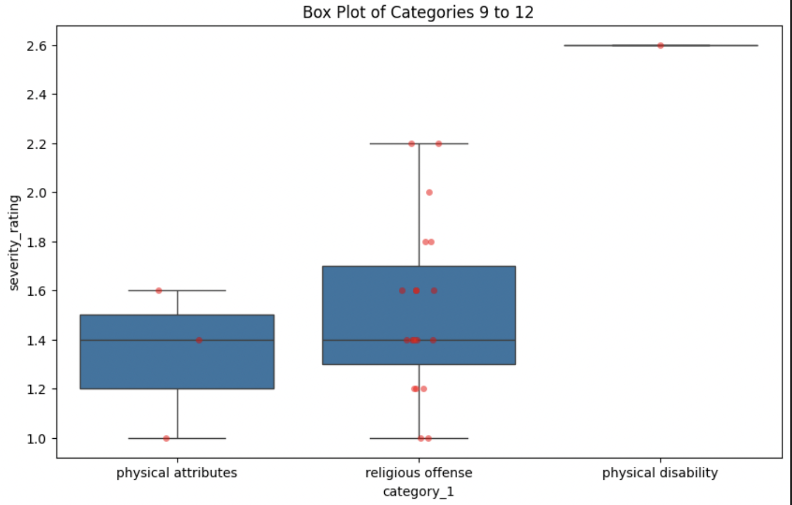

**Figure 6: Box Plot 3**
	
 Data Analysis: Given "Physical Disability" category only has one data point that is 2.6, it's not enough to have a box plot for the category but it could lead to a higher median if more data would be found for uses of insults revolving that category. "Physical Attributes" and "Religious Offense" both have similar median but religious offenses have a wider range of values that do mostly stay below average, although there are some that aren't outliers but reach slightly above average. In comparison, insults to physical attributes, with much less data than religious offenses, are on just about the lower end of the severity ratings.

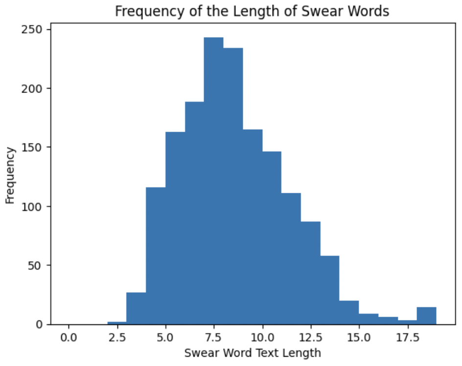

**Figure 7: Frequency of the Length of Swear Words**
	
 Data Analysis: The frequency data above follows roughly what a normal distribution graph would look like with the data points ranging from 0 to about 18. There's a little of a left-tailed in this graph, with an emphasis on the values lower than 7.5 as there's a small jump at the end of the data point of 17.5, showing that the outliers would likely be values that are close to the maximum as opposed to the minimum length.

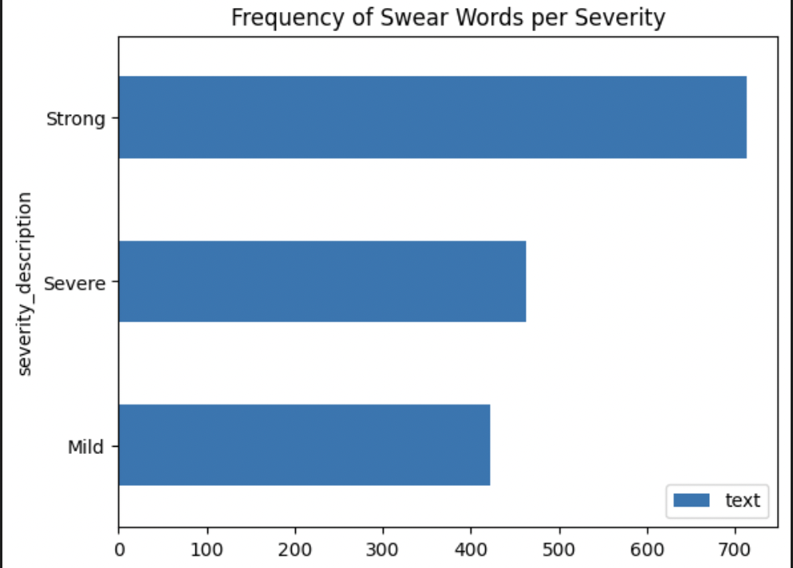

**Figure 8: Frequency of Swear Words per Severity**
	
 Data Analysis: The 3 categories of the severity ratings "Severe", "Mild", and "Strong" have hundreds of words that fall into each category, although it's a much more noticeable jump from the first two categories to the "Strong" category. The data here also indicates that more words fall around the average severity ratings, with slightly more words falling above average given more words are in the "Severe" category than the "Mild" category.

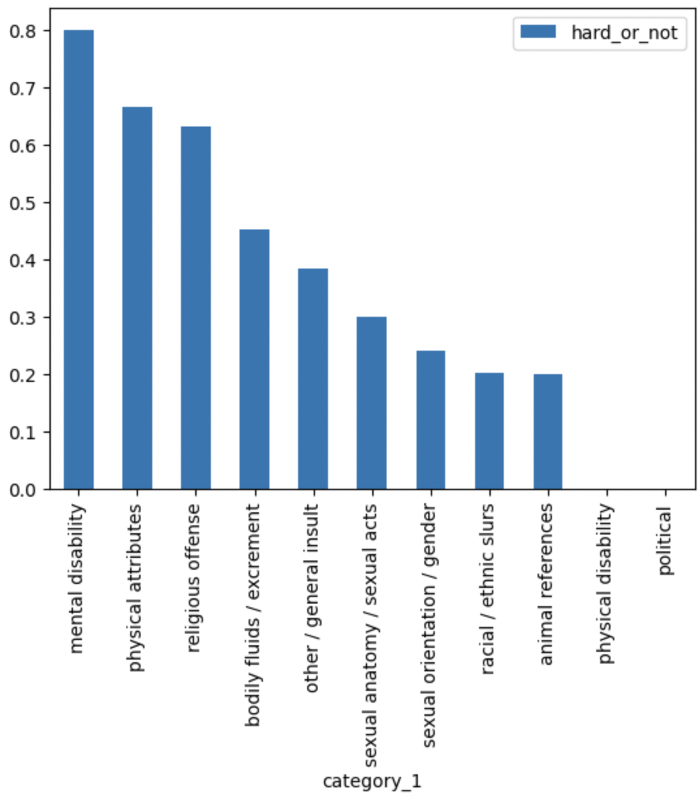

**Figure 9: Frequency of Swear Words per Severity**

The bar chart shows the proportion of hard consonants at the end of offensive words across different categories. The hard_or_not axis indicates the frequency of hard consonants, while category_1 represents various categories of offensive terms. 

Categories like "mental disability," "physical attributes," and "religious offense" have the highest proportion of hard consonants, suggesting that the harshness of sound might contribute significantly to their offensive nature.
Categories such as "political," "physical disability," and "animal references" have the lowest proportions, indicating that these terms might rely more on their context or content rather than sound to convey offensiveness.
The presence of hard consonants varies significantly across categories, reflecting differences in how offensiveness is expressed and perceived in language.

### Summary

- The most common swear words exhibit a steep drop-off in frequency after the top few terms.
- Insults targeting race, physical disability, and political affiliations are perceived as most severe.
- The "sexual anatomy / sexual acts" category is overwhelmingly the most frequent.
- Categories like "racial / ethnic slurs" and "political" have high severity, while "animal references" are least severe.
- Swear word lengths mostly fall within a normal distribution, skewing slightly towards shorter words.
- There is a higher frequency of words rated as "Severe", suggesting a greater emphasis on highly offensive terms.
- Some categories exhibit higher proportion of hard consonants 

# Predictive Model

Given our exploratory data analysis (EDA), we decided to create a predictive model to classify offensive language into various categories based on their severity and specific characteristics.

In this section, we explore the development and evaluation of predictive models to classify offensive content. Our aim is to leverage the insights gained from the EDA to construct robust classifiers capable of distinguishing between different categories of offensive language. By implementing and comparing different machine learning algorithms, we seek to identify the model that provides the highest accuracy and best overall performance.

## Preprocessing

1. **Data Preparation**: The dataset consists of texts of swear words, severity ratings, and a binary indicator for profanity hardness. 

2. **Train-Test Split**: The dataset is split into training and testing sets to train the model on one set and evaluate its performance on another.

3. **Feature Engineering**:
    - **N-gram Features**: N-grams are sequences of n items from the text. Bi-grams and tri-grams are extracted from the text samples, counting their occurrences to construct feature vectors.
	- 
    - **Severity Rating and Hardness Indicator**: Additional features include severity ratings and a binary indicator for profanity that end with a hard consenants.

4. **Label Binarization**: The target variable (profanity categories) is binarized to convert categorical labels into a binary matrix representation for later representation in Receiver Operating Characteristic (ROC) curve and Precision vs Recall Curve.

5. **Concatenation**: Extracted n-gram features, severity ratings, and hardness indicators are concatenated to form the final feature matrices for training and testing.

## Naive Bayes Model Report

Naive Bayes classifiers are based on Bayes' theorem with the assumption of conditional independence between every pair of features given the value of the class variable. This assumption simplifies the computation and is given by:

$$P(C \mid X) = \frac{P(C) \cdot P(X \mid C)}{P(X)}$$

In practice, we aim to maximize the posterior probability $P(C \mid X)$, and we often drop $P(X)$ as it is constant for all classes.

### Model Diagnostics

The Naive Bayes classifier achieved an accuracy of around 74%. Below are the detailed diagnostics including the confusion matrix, precision-recall curves, and One-vs-Rest multiclass ROC.

### Confusion Matrix
The confusion matrix shows the performance of the classification model on a set of test data for which the true values are known. The matrix illustrates the number of correct and incorrect predictions made by the model compared to the actual classifications in the test data.

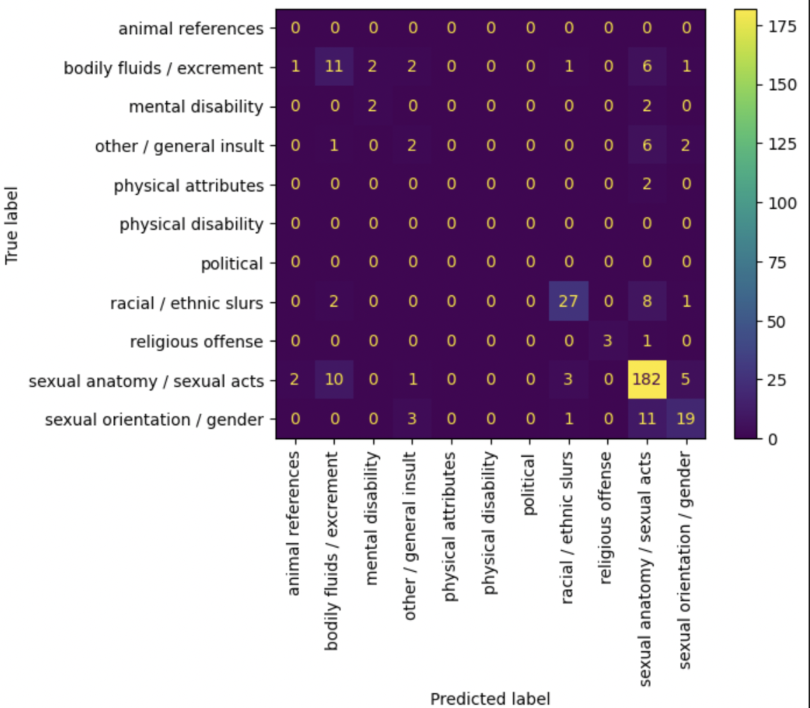

Because this a multiclass classifier, it is hard to purely disect the recall and percision of the classifier, and thus we must plot it.

### Precision-Recall Curve
The precision-recall curve is a plot of the precision (y-axis) versus the recall (x-axis) for a classifier at different threshold settings. It is useful for evaluating models when the classes are imbalanced.

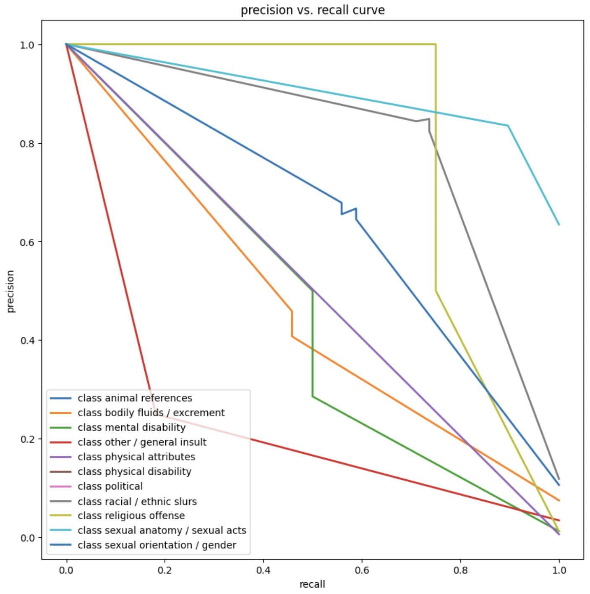
**Analysis:**

As one can see, there is wide variety of percision/recall strength when looking at the curve. Categories such as `religious offence`, `sexual_anatomy / sexual acts`, `racial / ethnic slurs`, and `sexual orientation / gender` perfrom reasonably well by maintaing a wide range of recall values, indicating that the model is effective in detecting these categories. However, categories of `bodily fluids / excrement`, `mental disability`, and `physical attributes` had moderate performance and `animal references`, `other / general insult`, `physical disability`, and `political` were poor or even missing from the graph. The missigness is a sign that there were no values that were predicted from that class, so there was no way to plot the Precision vs. Recall Curve

### One-vs-Rest multiclass ROC
The ROC curve, or Receiver Operating Characteristic curve, is a graphical representation of the true positive rate (TPR) versus the false positive rate (FPR) at various threshold settings. The area under the curve (AUC) is used as a measure of the model’s ability to distinguish between classes. An AUC of 1 indicates a perfect model, while an AUC of 0.5 suggests no discriminative ability. In this case, because we are multi-classed, we will use the One-vs-Rest multiclass ROC. In each step, a given class is regarded as the positive class and the remaining classes are regarded as the negative class as a bulk.

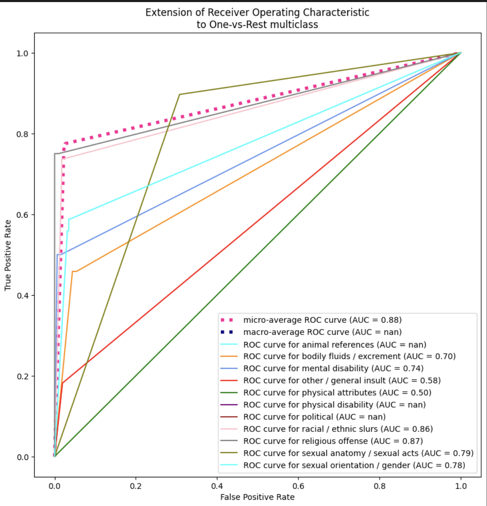

**Analysis:**
The model demonstrated strong performance in distinguishing `racial/ethnic`, `religious offence` and `sexual anatomy / sexual acts`, indicating high discriminative power for these classes. On the other hand, the model showed moderate performance for classes such as`sexual orientation/gender`, `mental disability` and `bodily fluids`, suggesting room for improvement. The classifier struggled significantly with `physical attributes` and `general insults`, as its performance in these areas was quite poor, indicating a need for further refinement.

Moreover, there are some NAN values. This indicates that for those categoires, the true positive rate (TPR) and false positive rate (FPR) cannot be calculated, meaning there was no predictions in those categories, resulting in no ROC. 

The ROC curve shows that the classifier performs well overall, as indicated by the micro-average AUC of 0.88. However, there are variations in performance across different classes, with some classes having high AUC values and others having issues, as indicated by the nan AUC values. This suggests that the classifier may need improvement and more data for specific classes to achieve better performance uniformly.

Overall, the Naive Bayes classifier performed reasonably well, especially given the assumptions and the complexity of the task. It shows strong performance in certain categories such as `racial/ethnic `slurs and `sexual anatomy / sexual acts`, while struggling more with categories like `physical attributes` and `general insults`. The model's precision and recall values vary significantly across different classes, reflecting the challenges in correctly classifying some types of offensive content.

## Logestic Regression

After the perforance of Naive Bayes having the assumption of independence of each feature, we decided to use a different model, logestic regression. In the context of multiclass classification, logistic regression can be extended using the one-vs-rest (OvR) strategy. This approach involves breaking down a multiclass classification problem into multiple binary classification problems.

### Model Diagonistics

### Confusion Matrix and Precision-Recall Curve

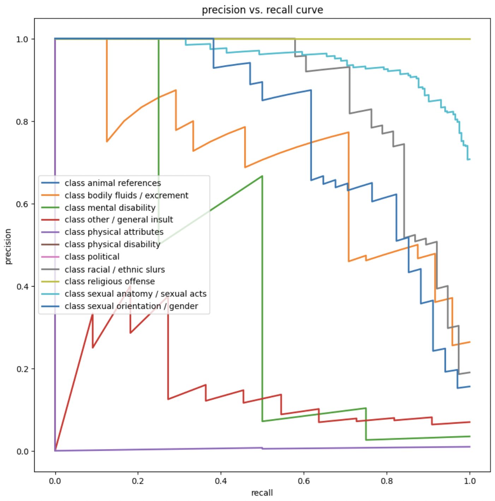

Upon fitting the logestic regression model, the model came to be about a 83% accuracy. As you can see from the Precision vs. Recall curve,  there seems to show much better fit for classes that already performing fairly well in the Naive Bayes Model. For instance, `Religious Offenses` has a perfect 1 to 1 precision vs recall curve (). However, the increased metrics of the classes that already faired well does not seem to have increased the classes that were doing poorly. This is probably because there is not enough data for those classes.

### One-vs-Rest multiclass ROC

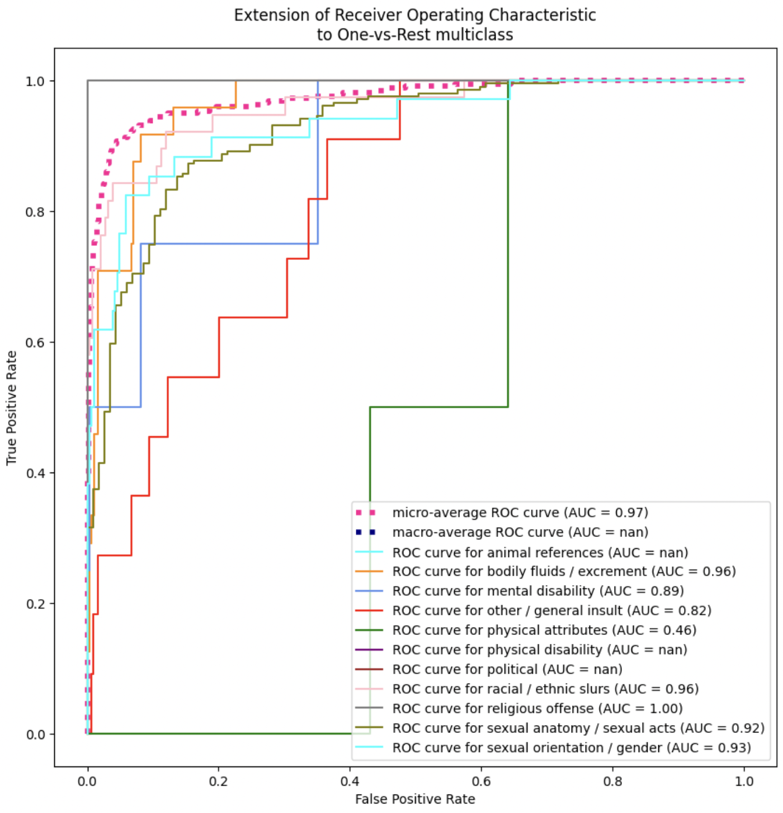

It seems that the NaN values have not changed suggesting again that the predictions between these classes don't have enough data. However, looking the classes that are non NAN, other than `physical attributes`, the curves show a large AUC, suggesting strong discrimination between classes. 

### Conclusion 

The Naive Bayes and Logistic Regression classifiers were compared to evaluate their performance on a multiclass classification task involving offensive content categorization. Each model's strengths and weaknesses were analyzed based on key metrics such as accuracy, confusion matrix, precision-recall curves, and One-vs-Rest ROC curves.

#### Naive Bayes Classifier
The Naive Bayes classifier, with its assumption of conditional independence, achieved an accuracy of around 74%. This model demonstrated strong performance in detecting certain categories like `religious offense`, `sexual anatomy / sexual acts`, and `racial / ethnic slurs`, as indicated by their robust precision-recall curves and high ROC AUC values. However, it struggled with categories such as `physical attributes`, `general insults`, and `political` references, often resulting in poor or even missing predictions for these classes. The variability in performance across different categories highlights the limitations of the Naive Bayes approach, particularly in handling the nuances of diverse and imbalanced data sets.

#### Logistic Regression Classifier
Similarly, the Logistic Regression classifier, using the One-vs-Rest (OvR) strategy, achieved a higher accuracy of 83%. This model showed improved precision-recall and ROC performance for the categories that already performed well under Naive Bayes, such as `religious offenses` and `sexual anatomy / sexual acts`. The AUC values for these categories were notably higher, indicating better discriminative power. However, similar to Naive Bayes, the Logistic Regression classifier also faced challenges with less represented categories like `physical attributes` and `general insults`, reflecting the need for more data to improve prediction accuracy for these classes.

#### Comparative Analysis
The Logistic Regression classifier generally outperformed the Naive Bayes model, particularly for well-represented classes. The ROC curves for Logistic Regression indicated stronger discriminative ability for most categories. However, both models exhibited limitations with poorly represented classes, which suggests that the primary issue is the imbalance and scarcity of data in these categories rather than the choice of the classifier.

### Recommendations
To enhance the performance of both classifiers, especially for underrepresented categories, the following steps are recommended:
1. **Data Augmentation:** Collect more data for the poorly performing categories to ensure a balanced representation.
2. **Feature Engineering:** Explore advanced feature engineering techniques to better capture the nuances of the text data.
3. **Hybrid Models:** Consider using ensemble methods that combine the strengths of different classifiers to improve overall performance.
4. **Regularization Techniques:** Apply regularization methods to handle data imbalance and prevent overfitting, particularly for Logistic Regression.

### Final Thoughts
The comparison underscores the importance of data quality and quantity in training robust classification models. While the Logistic Regression classifier showed superior performance overall, both models' effectiveness is contingent upon addressing data imbalances. Future efforts should focus on enriching the dataset and exploring hybrid modeling approaches to achieve more consistent and reliable classification across all categories.

